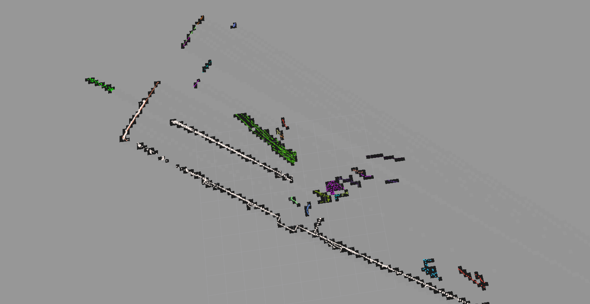
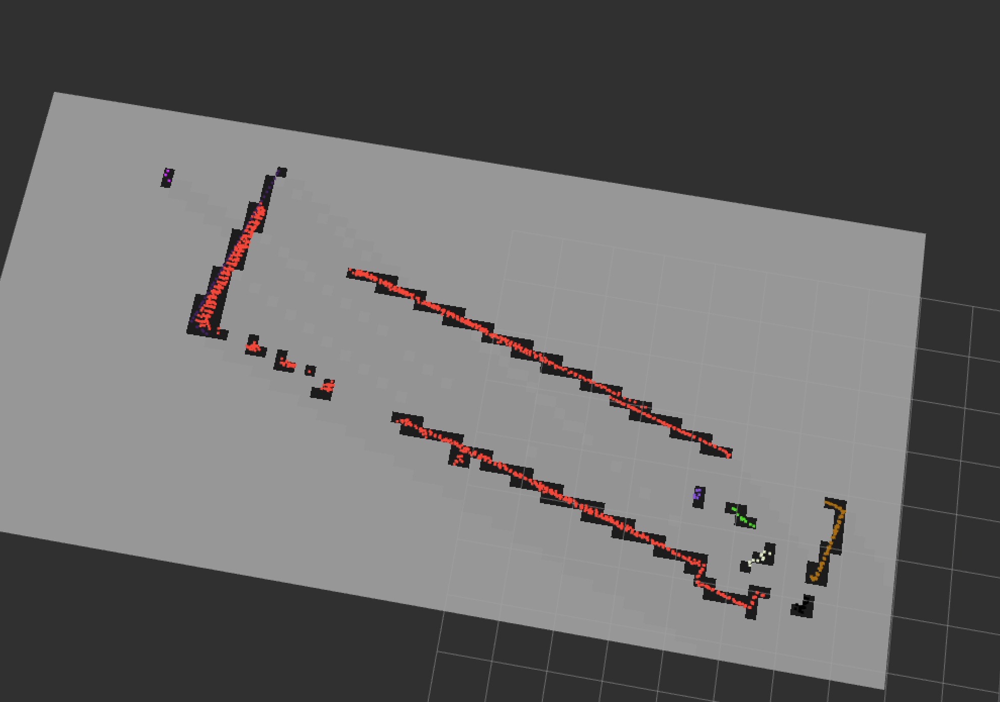

# Obstacle_node
Hi all, I'm going to start yapping again!

## Angle Bins and Ray Tracing Via Bresenham's Line Algo

# Important Links
[Rasterize a point cloud](https://r-lidar.github.io/lasR/reference/rasterize.html)